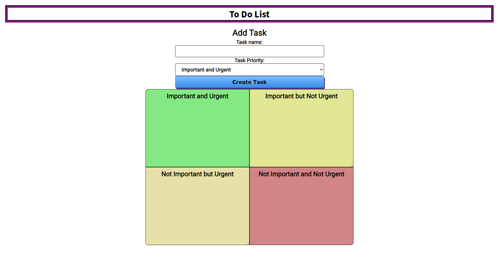

# To Do List

## Link

https://psyckalla.github.io/to-do-list/

## Summary

The user is able to add items based on their level of Importance and Urgency to four seperate boxes. Red indicates Important and Urgent, the yellow boxes indicate either Not Important but Urgent, or Important but Not Urgent, and green indicates Not Important and Not Urgent. Items may be deleted or checked off as they are finished. 

## Technology used

I used HTML, CSS, JavaScript and jQuery to make this To Do List. 